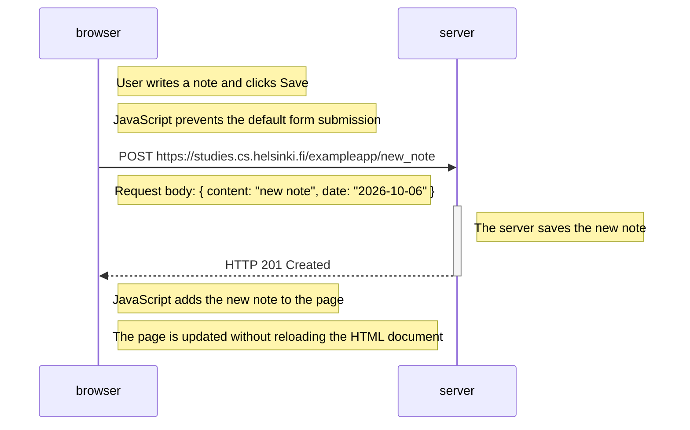

```mermaid
sequenceDiagram
    participant browser
    participant server

    Note right of browser: User writes a note and clicks Save
    Note right of browser: JavaScript prevents the default form submission
    browser->>server: POST https://studies.cs.helsinki.fi/exampleapp/new_note
    Note right of browser: Request body: { content: "new note", date: "2026-10-06" }
    activate server
    Note right of server: The server saves the new note
    server-->>browser: HTTP 201 Created
    deactivate server

    Note right of browser: JavaScript adds the new note to the page
    Note right of browser: The page is updated without reloading the HTML document
```
